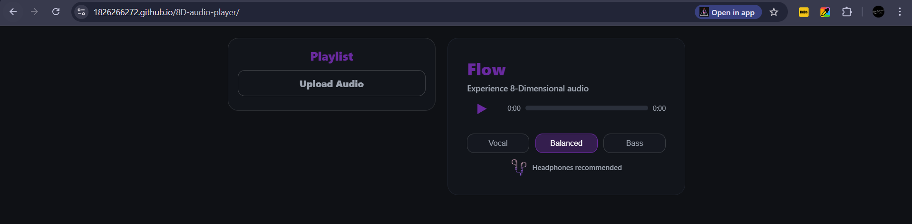
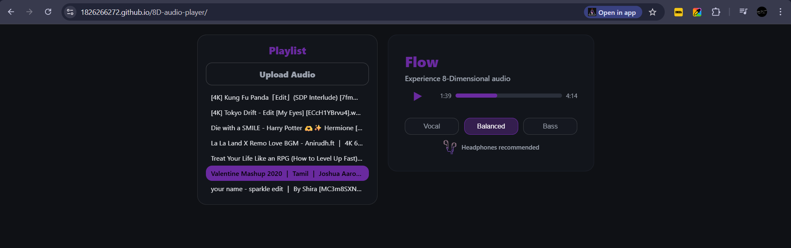

# 🎧 8D Audio Player




An immersive web-based audio player that simulates **8D spatial audio effects** using stereo sound manipulation.
This project demonstrates how audio panning and spatial effects can create the illusion of sound moving around the listener.

---

## 🚀 Features

* Play audio with simulated **8D effect**
* Smooth audio controls
* Lightweight UI
* Headphone-optimized listening experience
* Simple and responsive design

---

## 🧠 What is 8D Audio?

8D audio is not actually “eight-dimensional” sound — it’s a **binaural audio illusion** created using stereo panning, reverb, and delay effects to make audio feel like it’s moving around your head. ([MakeUseOf][1])

When listened to using headphones, it creates an **immersive spatial listening experience** similar to being inside a live performance. ([tempolor.com][2])

---

## 🧰 Tech Stack

* HTML
* CSS
* JavaScript
* Web Audio API

---

## 📁 Project Structure

```
8D-audio-player
│
├── index.html
├── style.css
└── script.js
```

---

## ⚙️ How to Run Locally

Clone the repository:

```
git clone https://github.com/1826266272/8D-audio-player.git
```

Open `index.html` in your browser.

For the best experience, **use headphones**.

or

Visit  
``` 
https://1826266272.github.io/8D-audio-player/
```
---

## 🎯 Learning Outcomes

This project helped me learn:

* Audio manipulation in JavaScript
* Stereo panning concepts
* Web Audio API basics
* Building interactive media applications
* UI design for media players

---


[1]: https://www.makeuseof.com/what-is-8d-audio/?utm_source=chatgpt.com "What Is 8D Audio?"
[2]: https://www.tempolor.com/blog/blog/what-is-8d-audio/?utm_source=chatgpt.com "What is 8D Audio? Tempolor Complete Guide - Tem.Polor"
